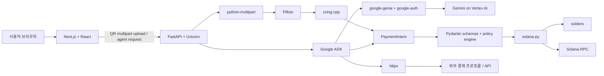

# 의존성 패키지 역할과 관계

- 기준 브랜치: `dev`
- 기준 환경: Python 3.12.13 / Node.js 24.16.0 / pnpm 11.9.0
- Python 잠금 파일: `requirements.lock`
- Node.js 잠금 파일: `pnpm-lock.yaml`

## 1. 문서 목적

이 문서는 Agentic Checkout P0 환경에 직접 설치한 패키지와 주요 전이 의존성이 어떤 역할을
담당하고, QR 입력부터 Gemini 도구 호출과 Solana 결제까지 어떤 관계로 연결되는지 설명한다.

`pyproject.toml`과 `apps/web/package.json`은 사람이 관리하는 직접 의존성 목록이다.
`requirements.lock`과 `pnpm-lock.yaml`은 재현 가능한 설치를 위한 전체 전이 의존성의 정확한
버전을 기록한다. 버전이 충돌할 경우 lockfile을 임의로 수정하지 않고 원본 선언을 변경한 뒤
다시 생성한다.

## 2. 전체 의존성 구조



핵심 경계는 다음과 같다.

- Gemini와 ADK는 작업 순서와 도구 호출을 조율한다.
- QR 디코딩과 결제 의도 파싱은 결정론적 Python 코드가 담당한다.
- 정책 검증과 금액 계산은 Pydantic 기반 스키마와 일반 코드가 담당한다.
- 개인키와 서명은 Gemini 컨텍스트에 전달하지 않고 Solana 실행 계층에 격리한다.
- 웹 애플리케이션은 시연용 클라이언트이며 결제 안전성의 최종 책임을 갖지 않는다.

## 3. Python 환경과 패키지 관리

### `venv`

Python 패키지는 저장소 루트의 `.venv`에만 설치한다. 시스템 Python이나 전역 site-packages를
사용하지 않는다. `.venv`는 머신별 바이너리를 포함하므로 Git에는 추가하지 않는다.

### `pyproject.toml`

프로젝트 메타데이터, Python 3.12 제약, 직접 런타임 의존성, 개발 의존성 및 Ruff·Mypy·pytest
설정을 관리한다.

### `pip-tools`와 `requirements.lock`

`pip-compile`은 `pyproject.toml`의 직접 의존성을 해석해 전이 의존성까지 정확한 버전으로
고정한다. 현재 `pip-tools 7.6.0`과의 호환성을 위해 가상환경의 pip는 `<26.2` 범위를 사용한다.

설치 흐름은 다음과 같다.

```text
pyproject.toml
    ↓ pip-compile
requirements.lock
    ↓ pip install -r
.venv
    ↓ pip install --no-deps -e .
로컬 agentic-checkout 패키지
```

## 4. Python 런타임 직접 의존성

| 패키지 | 설치 버전 | 역할 | 주요 관계 |
|---|---:|---|---|
| `google-adk` | 2.6.1 | Gemini 기반 에이전트, 도구 등록, 실행 흐름 및 세션 기반 제공 | `google-genai`, `google-auth`, FastAPI, OpenTelemetry 등을 사용 |
| `fastapi` | 0.141.1 | QR 업로드, 에이전트 실행, 상태 조회용 HTTP API | Pydantic 스키마와 Starlette ASGI 계층 사용 |
| `uvicorn[standard]` | 0.52.0 | FastAPI/ADK API를 실행하는 ASGI 서버 | `h11`, `httptools`, `watchfiles`, `websockets` 사용 |
| `pydantic-settings` | 2.14.2 | `.env`와 환경변수에서 설정을 타입 안전하게 로드 | Pydantic과 `python-dotenv` 사용 |
| `httpx` | 0.28.1 | 외부 결제 URL, x402/pay.sh 및 일반 HTTP API 호출 | `anyio`, `httpcore`, TLS 인증서 패키지 사용 |
| `python-multipart` | 0.0.32 | FastAPI에서 QR 이미지 파일 업로드 파싱 | 업로드 바이트를 QR 처리 계층에 전달 |
| `pillow` | 12.3.0 | 업로드 이미지 열기, 크기·포맷 제한, 픽셀 변환 | 애플리케이션 코드에서 `zxing-cpp` 입력으로 연결 |
| `zxing-cpp` | 3.1.1 | QR/바코드에서 원본 결제 문자열 추출 | 디코딩만 담당하며 URL 접속이나 결제를 수행하지 않음 |
| `solana` | 0.40.1 | RPC 조회, 토큰 계정 조회, 트랜잭션 전송과 확인 | `solders`, `httpx2`, `websockets`, `aiolimiter` 사용 |
| `solders` | 0.28.0 | 공개키, 키페어, 명령, 메시지, 트랜잭션 등 저수준 Solana 타입 | `solana-py` 내부와 guarded executor에서 사용 |

### 중복되어 보이는 패키지의 구분

`solana`와 `solders`는 대체 관계가 아니다.

- `solana-py`는 비동기 RPC 클라이언트와 고수준 네트워크 작업을 제공한다.
- `solders`는 Rust 구현에 기반한 공개키·명령·트랜잭션 타입과 서명 기능을 제공한다.
- P0에서는 `solana-py`로 Devnet RPC와 통신하고 `solders` 타입으로 거래를 조립·서명한다.

`Pillow`와 `zxing-cpp`도 역할이 다르다.

- Pillow는 신뢰할 수 없는 업로드 이미지를 열고 크기와 픽셀 포맷을 통제한다.
- zxing-cpp는 정규화된 이미지에서 QR payload 문자열을 판독한다.
- 두 패키지 모두 payload를 해석하거나 결제하지 않는다.

## 5. 주요 Python 전이 의존성

전체 목록과 정확한 버전은 `requirements.lock`을 기준으로 한다. 아래는 아키텍처 이해에 필요한
주요 그룹만 정리한 것이다.

| 그룹 | 주요 패키지 | 상위 패키지에서의 역할 |
|---|---|---|
| Gemini 연결 | `google-genai`, `google-auth` | Gemini API 호출과 Google Cloud 인증 |
| ADK 실행 | `aiohttp`, `aiosqlite`, `authlib`, `jsonschema`, `tenacity` | 비동기 통신, 로컬 세션 상태, 인증, Tool 스키마, 재시도 |
| 관측성 | `opentelemetry-api`, `opentelemetry-sdk` | 에이전트와 도구 실행 추적을 Cloud Logging/Trace로 확장할 기반 |
| API 모델 | `pydantic`, `pydantic-core`, `starlette`, `anyio` | 요청 검증, ASGI 요청 처리, 동시성 |
| HTTP | `httpcore`, `certifi`, `idna`, `websockets` | HTTP/TLS/실시간 통신 기반 |
| Solana 직렬화 | `construct-typing`, `jsonalias` | Solana 데이터 구조와 solders 타입 변환 지원 |

전이 의존성은 애플리케이션에서 직접 import하지 않는 한 `pyproject.toml`에 중복 선언하지 않는다.
애플리케이션 코드가 전이 패키지를 직접 사용하기 시작하면 직접 의존성으로 승격한다.

## 6. Python 개발 의존성

| 패키지 | 설치 버전 | 용도 |
|---|---:|---|
| `pip-tools` | 7.6.0 | `requirements.lock` 생성 |
| `pytest` | 9.1.1 | 단위·통합 테스트 실행 |
| `pytest-asyncio` | 1.4.0 | 비동기 RPC·도구·API 테스트 |
| `ruff` | 0.16.1 | Python lint와 import 정렬 |
| `mypy` | 1.20.2 | `apps`와 `packages`의 strict 타입 검사 |

개발 의존성은 Cloud Run 런타임에 반드시 포함할 필요가 없다. 배포 이미지 최적화 단계에서는
런타임 전용 requirements를 별도로 만들 수 있지만, P0에서는 재현성과 단순성을 우선해 하나의
lockfile을 사용한다.

## 7. 웹 런타임 의존성

| 패키지 | 설치 버전 | 역할 | 관계 |
|---|---:|---|---|
| `next` | 16.2.12 | App Router, 서버 렌더링, 정적 빌드와 웹 개발 서버 | React 위에서 UI와 API 연결을 구성 |
| `react` | 19.2.8 | QR 업로드·정책·타임라인 UI 컴포넌트 모델 | `react-dom`이 브라우저 DOM에 렌더링 |
| `react-dom` | 19.2.8 | React 컴포넌트의 브라우저 렌더링 | React와 동일 버전으로 고정 |

Next.js의 `sharp 0.34.5`는 이미지 처리 최적화를 위한 전이 의존성이다. 프로젝트 QR 보안 검사는
Python의 Pillow/zxing-cpp가 담당하며, `sharp`는 그 검증을 대체하지 않는다.

## 8. 웹 개발 의존성

| 패키지 | 설치 버전 | 용도 |
|---|---:|---|
| `typescript` | 6.0.3 | strict TypeScript 검사와 Next.js 빌드 |
| `eslint` | 9.39.5 | JavaScript/TypeScript 정적 분석 |
| `eslint-config-next` | 16.2.12 | Next.js·React·접근성 권장 규칙 |
| `@types/node` | 24.13.3 | 현재 Node 24 런타임 타입 |
| `@types/react` | 19.2.18 | React TypeScript 타입 |
| `@types/react-dom` | 19.2.4 | React DOM TypeScript 타입 |

ESLint 10과 TypeScript 7의 최신 버전은 현재 `eslint-config-next 16.2.12`의 peer 범위를 벗어나므로
각각 호환되는 9.x와 6.0.x로 고정했다. `pnpm peers check`가 통과하는 조합을 유지한다.

## 9. pnpm 설치 스크립트 허용 정책

pnpm 11은 검토하지 않은 전이 패키지의 install/postinstall 스크립트를 기본적으로 차단한다.
`pnpm-workspace.yaml`의 `allowBuilds`에는 현재 필요한 두 패키지만 허용한다.

```yaml
allowBuilds:
  sharp: true
  unrs-resolver: true
```

- `sharp`: Next.js 이미지 처리용 네이티브 바이너리 확인
- `unrs-resolver`: ESLint import resolver가 사용하는 네이티브 모듈 준비

`dangerouslyAllowAllBuilds`는 사용하지 않는다. 새 패키지가 빌드 스크립트를 요구하면 패키지명,
버전, 출처와 필요성을 확인한 뒤 개별적으로 허용한다.

## 10. P0 실행 흐름과 패키지 연결

### QR 입력

```text
Next.js 파일 입력
→ FastAPI multipart endpoint
→ python-multipart
→ Pillow 이미지 제한·정규화
→ zxing-cpp QR 문자열 추출
→ PaymentIntent 파서
```

### 에이전트 판단

```text
FastAPI
→ Google ADK Agent
→ google-genai / Gemini
→ decode·resolve·balance·policy Tool 선택
→ 구조화된 Tool 결과 반환
```

Gemini는 QR 이미지 바이트, 지갑 개인키 또는 서명 가능한 트랜잭션을 직접 받지 않는다.

### Solana 결제

```text
검증된 PaymentIntent
→ Pydantic 정책 검증
→ solana-py RPC 잔액·계정 조회
→ solders 트랜잭션 조립·서명
→ solana-py 제출·확정 조회
→ 수취인·mint·금액·reference 검증
```

## 11. 현재 설치하지 않은 도구

| 도구 | 현재 상태 | 도입 시점 |
|---|---|---|
| Google Cloud CLI (`gcloud`) | 미설치 | Vertex AI 인증과 Cloud Run 배포 단계 |
| Docker | 미설치 | 로컬 컨테이너 재현이 필요할 때; Cloud Run source deploy에는 필수 아님 |
| Java | 미설치 | zxing-cpp가 네이티브 Python wheel을 제공하므로 필요 없음 |
| Make | 미설치 | Windows 재현성을 위해 현재 README의 PowerShell 명령 사용 |

## 12. 재현 및 검증 명령

### Python

```powershell
py -3.12 -m venv .venv
.\.venv\Scripts\python.exe -m pip install "pip<26.2"
.\.venv\Scripts\python.exe -m pip install pip-tools
.\.venv\Scripts\python.exe -m pip install -r requirements.lock
.\.venv\Scripts\python.exe -m pip install --no-deps -e .

.\.venv\Scripts\python.exe scripts\verify_environment.py
.\.venv\Scripts\python.exe -m pip check
.\.venv\Scripts\python.exe -m pytest
.\.venv\Scripts\ruff.exe check .
.\.venv\Scripts\mypy.exe
```

`pyproject.toml`의 의존성을 변경했다면 설치 전에 lockfile을 다시 만든다.

```powershell
.\.venv\Scripts\pip-compile.exe --extra dev --strip-extras --output-file requirements.lock pyproject.toml
```

### Web

```powershell
pnpm install --frozen-lockfile
pnpm peers check
pnpm lint:web
pnpm build:web
```

## 13. 업데이트 원칙

1. 직접 의존성 변경 이유를 먼저 이 문서 또는 PR에 기록한다.
2. Python은 `pyproject.toml`, Node.js는 `apps/web/package.json`에서 버전을 변경한다.
3. lockfile을 재생성하고 diff에서 예기치 않은 전이 패키지를 확인한다.
4. `pip check`와 `pnpm peers check`로 충돌을 검사한다.
5. Python 테스트·Ruff·Mypy와 웹 lint·production build를 모두 통과시킨다.
6. 네이티브 빌드 패키지가 추가되면 `allowBuilds`를 자동으로 전체 허용하지 않는다.
7. ADK, Solana, Next.js처럼 실행 경로에 직접 영향을 주는 패키지는 데모 직전에 무계획하게
   업그레이드하지 않는다.
